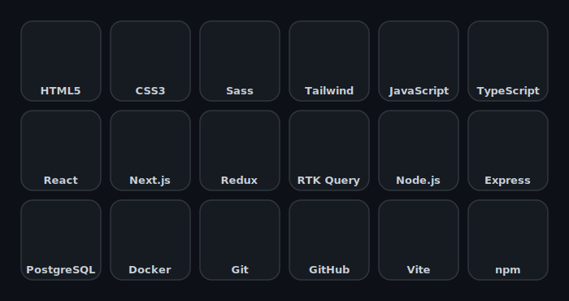

<h2 align="center">Hi 👋, I'm Aseda</h2>
<h3 align="center">Full-Stack Developer</h3>

I am a Full-Stack Developer with a passion for building modern, scalable, and reliable web applications. I work on both frontend and backend development, creating complete web solutions from user interfaces to server-side logic and APIs.

I focus on writing clean, understandable, and maintainable code while paying attention to application quality, security, and performance. I enjoy solving complex problems, learning new technologies, and continuously improving my professional skills.

My main goal is to build high-quality web solutions that bring real value to users and businesses through efficient, well-structured, and reliable software development.

I also have experience with API integration and working with modern AI technologies (Gemini AI, Claude AI, and others), applying next-generation solutions to build smarter and more efficient applications.

<h3 align="center">🛠️ Skills & Technologies</h3>

  

<h3 align="center">💡 Development Approach</h3>

Clean Code • Component-Based Architecture • Responsive Design • Scalable Solutions • Performance Optimization • API Integration • Modern UI/UX

